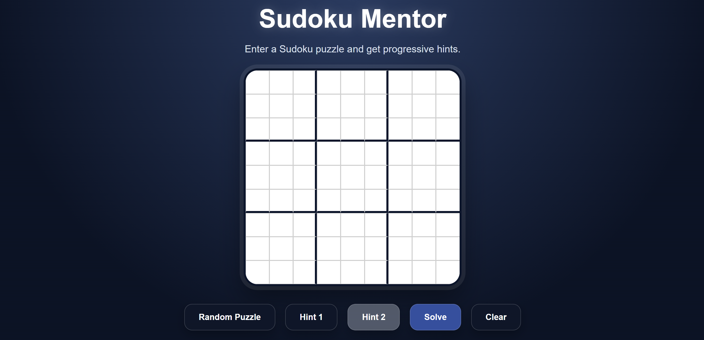
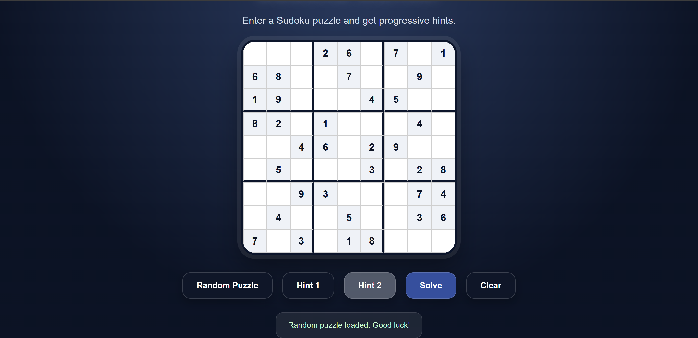

S# Sudoku Mentor

Sudoku Mentor is an interactive Sudoku-solving web application that helps users solve puzzles through progressive hints, validation, and intelligent solving algorithms.

---

## Live Demo

[Try Sudoku Mentor!!](https://adimangithub.github.io/Sudoku-Mentor/)

---

## Features

### Random Puzzle Generation
Load a random Sudoku puzzle instantly and start solving.

### Progressive Hint System
Instead of immediately revealing the answer:

- Hint 1 provides possible values for a cell
- Hint 2 reveals the exact row, column, and correct value

This helps users learn Sudoku rather than simply getting the solution.

### Sudoku Validation
The application automatically detects:

- Duplicate values in rows
- Duplicate values in columns
- Duplicate values in 3×3 boxes

Invalid puzzles are flagged with clear error messages.

### Automatic Solver
Uses a backtracking algorithm to solve any valid Sudoku puzzle.

---

## Tech Stack

### Languages

- HTML
- CSS
- JavaScript

## Project Structure

```
sudoku-mentor/
│
├── index.html
├── style.css
├── script.js
└── README.md
```

## Future Improvements

- Multiple difficulty levels
- Sudoku puzzle generator
- Timer and score tracking
- Hint explanations based on solving techniques
- Mobile-first responsive design
- Dark/Light mode toggle

---

## Screenshots




---

## Author

**Aditya Menon**

Computer Science Student

GitHub: https://github.com/adimangithub

---
